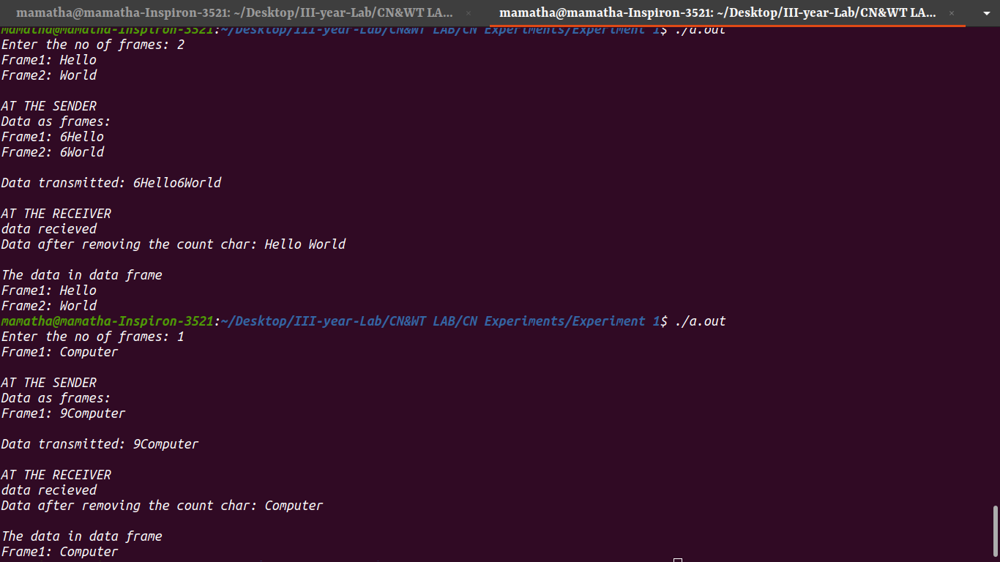

# Experiment - 1
## Aim of the Experiment
To implement data link layer framing techniques such as 
 
* Character counting
* Character stuffing
* Bit stufffing

## Experiment Procedure

* ### Charatcer counting
  * The data is taken from the user as normal strings.
  * In data frame the data frame length is added to the each dataframe at the begining.
  * After complete data is converted to the data frames it is transmitted to the receiver.
  * The data at the receiver end considers the data from the frame without the length of the data frame and prints it.

## Output

* **Character counting output: **

