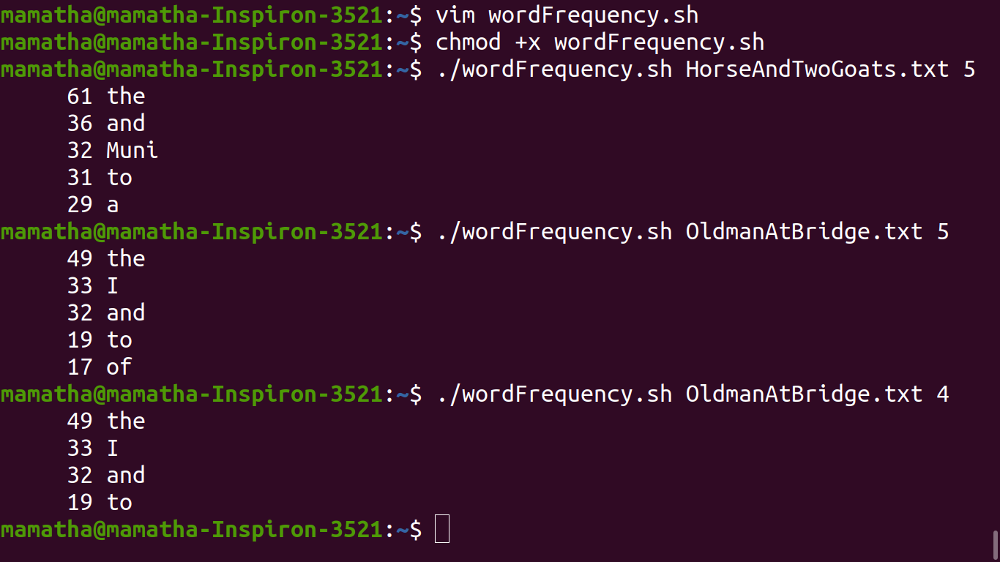

# Experiment - 1
## Aim of the Experiment
To implement data link layer framing techniques such as 
 
* Character counting
* Character stuffing
* Bit stufffing

## Experiment Procedure
1.
2.
3.
4.

## Output

