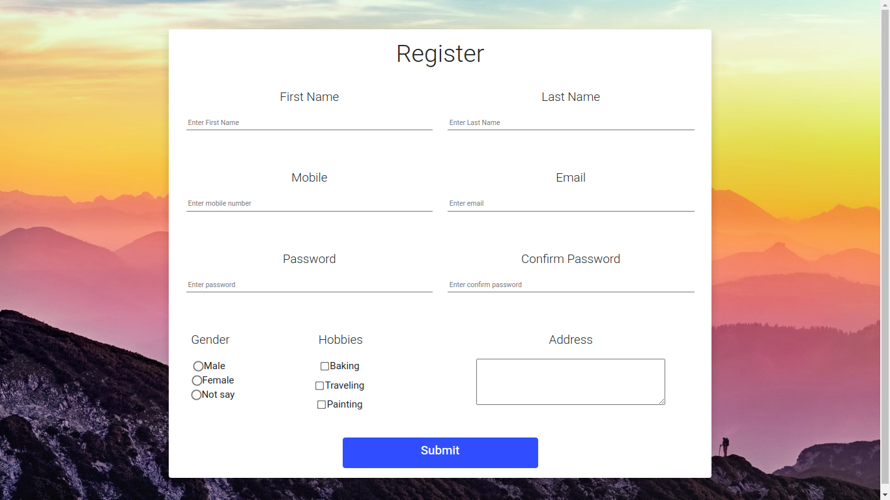

# Experiment - 5
## Aim of the Experiment
Develop static pages (using Only HTML) of an online book store. The pages should resemble:
www.amazon.com. The website should consist the following pages.
* Home page
* Registration and user Login
* User Profile Page
* Books catalog
* Shopping Cart
*  Payment By credit card
* Order Conformation

## Experiment Procedure

* ### Registration page
  * Components used:  
    1.Bootstrap  
    2.CSS  
    3.HTML 
## Output

* **Register Page output:**

